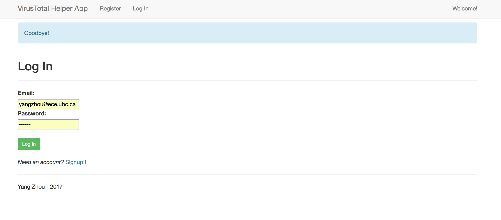

# VirusTotal Helper
VirusTotal Helper is a website that allows users to upload a text file as a list of hashes (MD5 or Sha256) and generates a simple report using information provided by querying VirusTotal's public API for the hashes.

# Run the Program
In the top-level folder, run command

```shell
	python run.py
```

Open the browser and the service is running at http://locallhost:5000



# Key Python Modules Used
- Flask(0.12) web framework
- flask-sqlalchemy(2.1) database ORM
- flask-login(0.4.0) user management
- flask-bcrypt(0.7.1) password hashing
- flask-wtf(0.14.2) simplifies forms

The application is written using python 2.7.12

# Services 
Service                                   | Description
--------------------------------------------- | ------------------------------------------------------
[User service](wiki/Users.md)               |      User registration/login/logout       |
[Report service](wiki/Reports.md)             |        File upload/report generation         |

# NOTICE

Since I am using the free basic API key, which only allows for 4 requests/minute maximum, the program will sleep for 16s each time making a VirusTotal's public API call. This however will result in very slow processing speed if we have large amount of hashes. 

### Reference  ###
* [VirusTotal's public API](https://www.virustotal.com/en/documentation/public-api/)