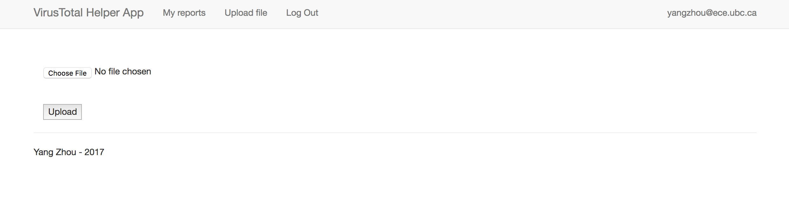
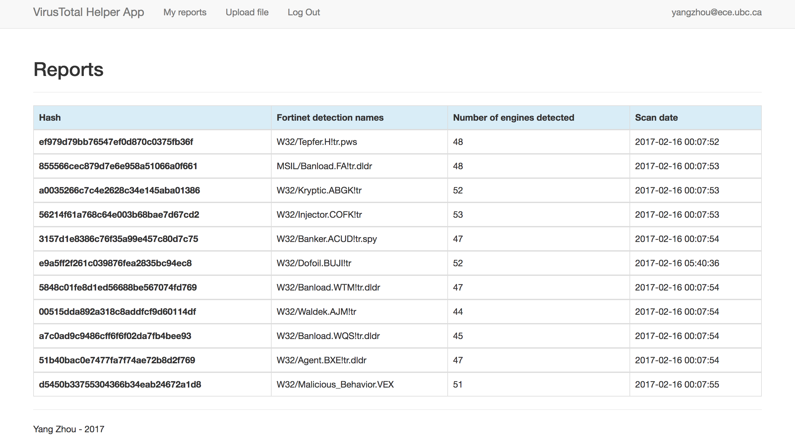

# Report Services

## Upload Hash File
Users can upload a text file as a list of hashes (MD5 or Sha256) and generates a report of this file. 

For each hash, if it is already contained in the database and the scan date is less than 1 day ago, the result from the database will be used directly. If the hash is not contained in the database or the scan date of hash in the database is beyond 1 day ago, VirusTotal's public API for the hashes will be called.

The response from the VirusTotal's public API is parsed and stored in the database. After processing all hash queries, a report summary table will be displayed for the file uploaded

## Check Personal Reports
